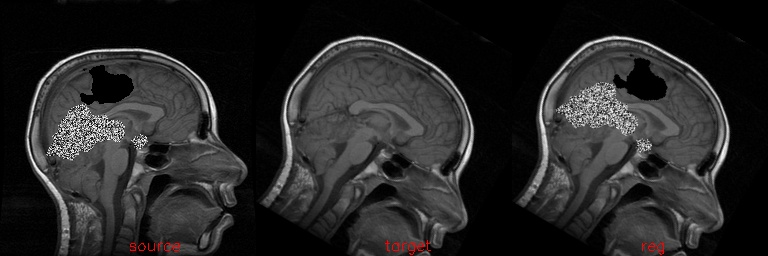

# Medical Image Registration with Partial Data
This program is aimed to convert the matlab code of [Medical Image Registration with Partial Data](http://cn.bing.com/academic/profile?id=325daecba3ffa26a7f37f56a28ed066b&encoded=0&v=paper_preview&mkt=zh-cn#) into C/C++. And you can find the matlab code from [here](http://www.cs.dartmouth.edu/farid/)

## Build
This code is based on OpenCV only, but you need cmake to build the project. You can use the following command build this project:
```
cd ${root_of_this_project}
mkdir build
cd build
cmake ..
make
```

Then a executable file will generate under `root_of_this_project/bin`. The basic usage of this tool is as following:
```
TEST source target
```

The finial result is as following:


