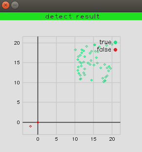

# LOCI: Fast Outlier Detection Using the Local Correlation Integral

This program is aim to implement the outliers detection algorithm introduced by this [paper](https://cn.bing.com/academic/profile?id=d2d342a00b53fb518047f0d34c7d5ebc&encoded=0&v=paper_preview&mkt=zh-cn)

## **DIFFERENCE**

Because some details described in this paper is not very clear (or just because my reading is pool), besides some technical details is hard to implement(may be). Our implementation is a little different.

* we fix $\alpha$ to 0.5, and $l_{\alpha}$ is fixed to 1.
* we scan all the levels to calculate $MDEF$ and $\hat{\sigma}_{MDEF}$, not from $n_{min}$ to $n_{max}$.
* The shifts we used are select randomly from the up and down bound in its corresponding dimension.

## Build

We still use CMake to build this program. And you should install the following libraries:

* [**OpenCV**](https://opencv.org/)
* [**cvplot**](https://github.com/leonardvandriel/cvplot) 
    * We use this library to plot the detect result. It is a nice framework based on OpenCV but have little bug when you use a high opencv version. A kind guy fix it, you can get it on [his github page](https://github.com/palerikm/cvplot)

You may also need CMake to compute this program.

## Result

The detect result on our test dataset.

